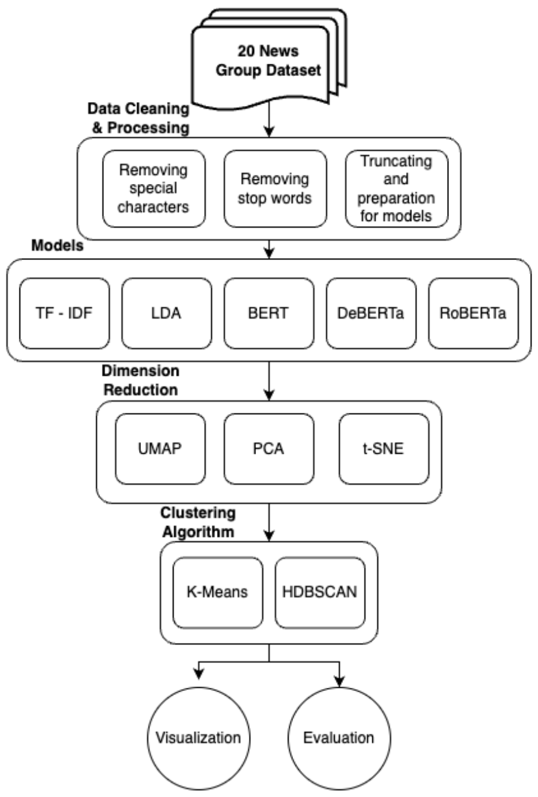
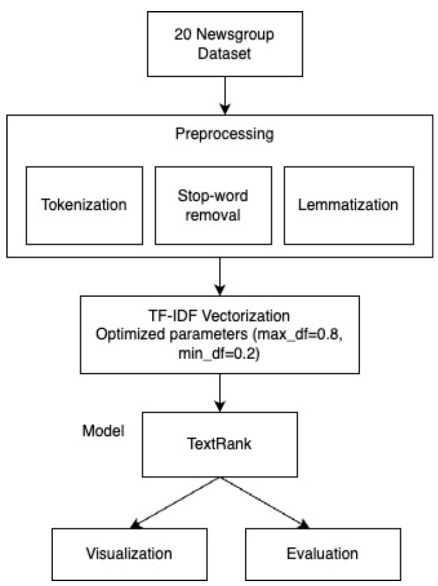

# CSE 573 - G26 P7:Document Clustering Summarization Visualization

This repository is the implementation of the project "Document Clustering, Summarization and Visualization". For this project we perform document clustering, summarization and draw out insightful visualization for 20 News group dataset. 

## Data
We use [20 Newsgroups data](http://qwone.com/~jason/20Newsgroups/) for the implementaion. The same data could be found in [sklearn](https://scikit-learn.org/0.19/datasets/twenty_newsgroups.html) as well, this data is saved as [20newsdata.csv](./data/20newsdata.csv).

## System Architecture and Algorithms

### Clustering

Following figure demonstrates the complete architecture and experiments for custering the documents.

### Summarization

Below figure demonstrates the architectureand experiments involved in abstractive and extractive summarization.

## Evaluation

### Clustering

#### RoBERTa

|                   | RAW       | UMAP     | PCA      | t-SNE     |
| ----------------- | --------- | -------- | -------- | --------- |
| Silhouette Score  | 0.05      | 0.468    | 0.406    | 0.32      |
| Davies Bouldin    | 3.68      | 0.74     | 0.77     | 0.85      |
| Calinski harabasz | 168.51    | 30561.54 | 13235.05 | 12130.29  |

Additional evauluatons can be found in [clustering notebook](./Clustering/bert%20lda%20clustering.ipynb).

### Summarization

|  ROUGE 1   | Precision  | Recall    | F-measure   |
| ---------- | ---------- | --------- | ----------- |
| PEGASUS    | 0.47       | 0.07      | 0.13        |
| GPT2       | 0.29       | 0.31      | 0.299       |

All visualizations can be found in respective notebooks: [clustering notebook](./Clustering/bert%20lda%20clustering.ipynb), [summarization](./Summarization/Abstractive_Summarization.ipynb)